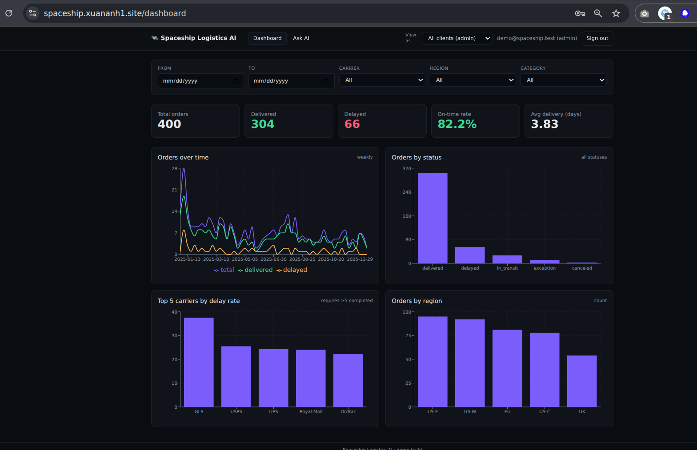
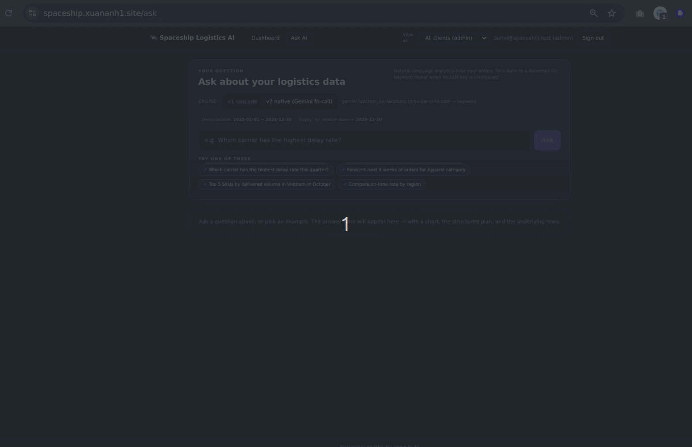

Spaceship Logistics AI
---

A small AI-powered logistics analytics dashboard built against the [Coding_assignment.md](Coding_assignment.md) brief.

- Live demo: https://spaceship.xuananh1.site
- Demo account: `demo@spaceship.test` / `demo123`
- Demo video: [YouTube](https://www.youtube.com/watch?v=ezeDug_4ee4)
- AI usage disclosure: [`AI_USAGE.md`](AI_USAGE.md)

Dashboard page:



Ask AI page:


**Table of Contents** 

- [1. What's in here](#1-whats-in-here)
- [2. Setup](#2-setup)
  - [2.1. Local setup instructions](#21-local-setup-instructions)
    - [2.1.1. Without Docker](#211-without-docker)
    - [2.1.2. With Docker](#212-with-docker)
  - [2.2. Environment variables](#22-environment-variables)
  - [2.3. Deploying to AWS](#23-deploying-to-aws)
- [3. Architecture](#3-architecture)
  - [3.1. System overview](#31-system-overview)
  - [3.2. Data flow](#32-data-flow)
  - [3.3. Key design decisions](#33-key-design-decisions)
  - [3.4. Repo layout](#34-repo-layout)
- [4. AI Approach](#4-ai-approach)
  - [4.1. How questions are interpreted](#41-how-questions-are-interpreted)
  - [4.2. How tools are selected](#42-how-tools-are-selected)
  - [4.3. The v1 → v2 story (and why both are still in the repo)](#43-the-v1--v2-story-and-why-both-are-still-in-the-repo)
  - [4.4. What the numbers actually say](#44-what-the-numbers-actually-say)
  - [4.5. The safety net](#45-the-safety-net)
  - [4.6. Anchoring "today" to the dataset](#46-anchoring-today-to-the-dataset)
  - [4.7. How they feel different in practice](#47-how-they-feel-different-in-practice)
- [5. Forecasting](#5-forecasting)
- [6. Multi-tenancy](#6-multi-tenancy)
- [7. Safety and explainability](#7-safety-and-explainability)
- [8. Assumptions](#8-assumptions)
  - [8.1. Metric definitions (delay\_rate, on\_time\_rate)](#81-metric-definitions-delay_rate-on_time_rate)
- [9. Limitations](#9-limitations)
- [10. Future Improvements](#10-future-improvements)


# 1. What's in here

A dashboard with the KPIs and charts the brief asks for, an "Ask AI" page that turns plain-English questions into validated query plans (no SQL ever generated by the LLM), a forecasting tool, a JWT-auth multi-tenant model, and a one-command deploy to a single EC2 box behind Caddy. The backend has 167 tests, all passing.

If you only have time to look at three things, look at:

1. The Ask AI page on the live demo. Try one of the suggested prompts, then click the *Plan* and *Raw rows* tabs to see what was actually executed.
2. [`backend/app/ai/fact_extractor.py`](backend/app/ai/fact_extractor.py) — the deterministic safety net both AI engines call after the LLM returns. It's the most useful thing in this repo.
3. The [v1 → v2 story](#the-v1--v2-story-and-why-both-are-still-in-the-repo) below, which is the architectural narrative.

# 2. Setup

## 2.1. Local setup instructions

### 2.1.1. Without Docker

```bash
cd backend
pyenv shell 3.11.12 && python -m venv .venv && source .venv/bin/activate
pip install -e ".[dev]" && pip install "bcrypt<4.0"
python -m app.data.importer ../data/mock_logistics_data.csv   # seeds 400 orders + demo user
pytest -q                                                      # 167 tests
uvicorn app.main:app --port 8000

# in another terminal
cd frontend && npm install && npm run dev
```

Open http://localhost:3000 and sign in with the demo creds.

### 2.1.2. With Docker

```bash
docker compose up -d --build

# run test in docker
docker compose exec -T backend bash -lc 'cd /app && PYTHONPATH=/app pytest -q'
```

There's a `docker-compose.override.yml` that bind-mounts `backend/` and `frontend/` so changes hot-reload — useful if you want to poke around the code while it's running.

## 2.2. Environment variables

Everything is env vars; defaults are demo-friendly. The full list is in [`.env.template`](.env.template). The ones that matter:

| Var | Default | Purpose |
|---|---|---|
| `DATABASE_URL` | `sqlite:////data/dev.db` | SQLAlchemy URL. Point it at `postgresql+psycopg://…` and nothing else has to change — the analytics layer talks to a `Repository` Protocol, not SQLAlchemy directly. |
| `JWT_SECRET` | demo string | Generate with `openssl rand -hex 32` for anything that isn't local dev. |
| `DEMO_USER_EMAIL` / `DEMO_USER_PASSWORD` | `demo@spaceship.test` / `demo123` | Seeded on first import. |
| `LLM_PROVIDER` | `keyword` | `keyword` (no API key, regex router), `gemini`, or `claude`. |
| `LLM_MODEL` / `LLM_API_KEY` / `LLM_BASE_URL` | empty | Required for non-keyword providers. |
| `FALLBACK_PROVIDER` | `keyword` | Next tier in the cascade; the live demo runs `gemini → keyword`. |
| `CORS_ORIGINS` | `http://localhost:3000` | Comma-separated origin list. |

The live AWS deployment runs `LLM_PROVIDER=gemini` (gemini-2.5-flash, no proxy) with `FALLBACK_PROVIDER=keyword`.

## 2.3. Deploying to AWS

```bash
cd infra
terraform init && terraform apply -auto-approve
# outputs: public_ip, ssh_command, url

cd ../deploy
PUBLIC_IP=$(cd ../infra && terraform output -raw public_ip) \
DOMAIN=spaceship.xuananh1.site \
JWT_SECRET="$(openssl rand -hex 32)" \
LLM_PROVIDER=gemini \
LLM_MODEL=gemini-2.5-flash \
LLM_API_KEY=<your-gemini-key> \
FALLBACK_PROVIDER=keyword \
PUBLIC_API_URL=https://spaceship.xuananh1.site \
./deploy.sh
```

Point the domain (Namecheap in my case) to the public IP via an A record and Caddy will provision a Let's Encrypt cert on the first request. To tear it down: `cd infra && terraform destroy -auto-approve`.


# 3. Architecture

## 3.1. System overview

Three layers, deliberately kept apart so each can be tested and reasoned about on its own:

- **Frontend** — Next.js 14 (App Router) + Tailwind + Recharts + React Query. Two screens: `/dashboard` (the descriptive analytics from the brief — KPIs and charts) and `/ask` (the diagnostic + predictive analytics, NL → answer + chart + raw rows).
- **Backend** — FastAPI + SQLAlchemy in front of SQLite (Postgres-swappable). Three internal packages: `api/` (HTTP), `analytics/` (KPI / breakdown / forecast computation), `ai/` (orchestration + providers + tools). The first never imports the third; the second and third never import the first.
- **AI orchestration** — a router that turns a question into a typed `QueryPlan` or `ForecastPlan`, plus a `KeywordRouter` terminal that always succeeds. Two engines (v1 cascade, v2 native function-calling) share the same tools and the same `fact_extractor` safety net. See [4. AI Approach](#4-ai-approach).

## 3.2. Data flow

```
┌────────────────────────┐     JWT (localStorage)     ┌─────────────────────────┐
│  Next.js 14 (Tailwind) │ ─────────────────────────▶ │   FastAPI (uvicorn)     │
│  /login                │                            │  /api/auth/{login,me}   │
│  /dashboard (KPIs)     │ ◀──────────────────────────│  /api/kpis              │
│  /ask  (NL → answer)   │      JSON + chart_spec     │  /api/charts/*          │
└────────────────────────┘                            │  /api/ask    (v1)       │
                                                      │  /api/v2/ask (v2)       │
                                                      └────────────┬────────────┘
                                                                   │
                                          ┌────────────────────────┼────────────────────────┐
                                          │                        │                        │
                                  ┌───────▼─────┐       ┌──────────▼─────────┐    ┌────────▼────────┐
                                  │ analytics/  │       │       ai/          │    │ repositories/   │
                                  │ kpis        │       │ RouterChain (v1)   │    │ OrderRepository │
                                  │ breakdowns  │       │ GeminiNative  (v2) │    │ (Protocol)      │
                                  │ forecast    │       │  ├─ Claude         │    │ SqlAlchemyOrder │
                                  │ chart_spec  │       │  ├─ Gemini         │    │ Repository      │
                                  └─────────────┘       │  └─ KeywordRouter  │    └────────┬────────┘
                                                        │  Tools shared:     │             │
                                                        │   query / forecast │     ┌───────▼──────┐
                                                        │   schema_inspect   │     │ SQLite/PG    │
                                                        └────────────────────┘     └──────────────┘
```

A request to `/api/v2/ask` flows like this: the frontend POSTs the question with the user's JWT → the route builds a small schema hint (carriers, regions, categories, dataset date range) → Gemini is called in `function_calling_config.mode=ANY` over a derived function-declarations schema and **must** call exactly one of `query`/`forecast`/`schema_inspect`/`clarify`/`refuse` → the returned plan goes through `fact_extractor.backfill_plan(...)` → the plan is validated against the allow-lists in [`app/ai/safety.py`](backend/app/ai/safety.py) → the matching tool runs it against `OrderRepository` → `chart_spec` picks an appropriate chart → an explanation string is composed (filters, metric, dimension, row count, provider) → a `QueryAudit` row is written → the JSON ships back. The v1 `/api/ask` flow is the same shape with a different orchestrator (cascade of LLMs instead of single function-call).

## 3.3. Key design decisions

Two rules I tried hard not to break:

- **The `analytics/` and `ai/` packages don't import FastAPI or SQLAlchemy.** They're plain Python over a `Repository` Protocol, which is what makes them easy to unit-test and what makes the SQLite-to-Postgres swap a one-liner.
- **The LLM never sees or emits SQL.** It produces a `QueryPlan` (a Pydantic model), the plan is validated against allow-lists for dimensions and metrics, and only then does the repository run it. There's a hard cap of two tool calls per question so nothing can loop.

The other choices worth flagging:

| Choice | Why |
|---|---|
| SQLite by default, Postgres swappable | 400 read-only rows; SQLite ships with Python; switching is one env var because analytics talks to a Protocol, not SQLAlchemy. |
| Holt-Winters auto-select for forecasting | Simple, well-tested, captures level and trend without fragile seasonality assumptions on a small series. ARIMA needs more tuning, Croston is for intermittent demand (not our shape), Prophet pulls in too much. |
| `delayed = status IN ('delayed','exception')` | The column already encodes operational outcome. There's no SLA column to derive from. |
| No raw-SQL escape hatch | The spec explicitly warns against it and the prompt-injection surface is real. The allow-listed plan is expressive enough for the spec questions. |
| Keep both v1 and v2 AI engines | The journey is the architectural point. v1 is also a useful one-click cascade fallback. |
| Single shared `fact_extractor` | Two separate backfills would drift. Sharing one converges the failure modes. |
| Pure-function `analytics/` and `ai/` | Trivial to unit-test, forces clean dependency direction. UseCase/Service classes everywhere would be over-engineered for ~2k LoC. |
| Single EC2 + Caddy + docker compose for deploy | No ALB cost, one IP to point Namecheap at, auto Let's Encrypt. ECS Fargate + ALB + RDS would be the obvious step up. |

## 3.4. Repo layout

```
backend/        FastAPI + SQLAlchemy + analytics + AI (v1 cascade + v2 native)
frontend/       Next.js 14 (App Router) + Tailwind + Recharts + React Query
data/           mock_logistics_data.csv
infra/          Terraform: EC2 + EIP + SG (default VPC)
deploy/         compose.yml + Caddyfile + deploy.sh for aws deployment
```

The files most worth opening:

- [`backend/app/ai/router.py`](backend/app/ai/router.py) — v1 cascade orchestrator
- [`backend/app/ai/providers/gemini_native.py`](backend/app/ai/providers/gemini_native.py) — v2 native function-calling
- [`backend/app/ai/fact_extractor.py`](backend/app/ai/fact_extractor.py) — the safety net
- [`backend/app/ai/providers/keyword.py`](backend/app/ai/providers/keyword.py) — terminal regex router
- [`backend/app/analytics/forecast.py`](backend/app/analytics/forecast.py) — Holt-Winters + MA + PI + inventory rec
- [`backend/app/api/routes_ask.py`](backend/app/api/routes_ask.py) and [`routes_ask_v2.py`](backend/app/api/routes_ask_v2.py)
- [`frontend/src/app/(shell)/ask/page.tsx`](frontend/src/app/(shell)/ask/page.tsx) — Ask AI page (engine toggle, three tabs)

# 4. AI Approach

## 4.1. How questions are interpreted

A question goes through three stages before anything touches the database:

1. **Schema priming.** The route handler builds a small "what exists in this dataset" hint at request time — the list of carriers, regions, product categories, the dataset's actual date range — and stitches it into the system prompt along with a hard `TODAY = 2025-12-30` anchor (the dataset's max date, not wall-clock time). This stops the model inventing carriers it has never seen and stops it resolving "last 3 months" against its training cutoff.
2. **Typed plan extraction.** The model is asked to emit a `QueryPlan` or `ForecastPlan` (Pydantic). In v2 this is enforced by Gemini's function-calling: the model literally cannot return free text, only an `args` object that matches the function's JSON Schema. In v1 the plan comes back as JSON, runs through a small `synonym_map.normalize_router_payload(...)` (`delayed_orders → delayed_count` and friends), then through `RouterResponse.model_validate_json(...)`; on `ValidationError` the prior text plus the error are sent back to the same model once with "return only corrected JSON".
3. **Deterministic backfill.** Whatever the LLM returns, [`backend/app/ai/fact_extractor.py`](backend/app/ai/fact_extractor.py) re-parses the original prompt and fills anything the model dropped — relative time (anchored to the dataset's max date), explicit month names, region/carrier/category filters, and `top_n` (if you said "top 10" and the LLM returned 5, your number wins). If the model returned a date window that has zero overlap with the dataset, that window is thrown away and replaced with the prompt's relative-time resolution.

The plan is then validated against the dimension and metric allow-lists in [`app/ai/safety.py`](backend/app/ai/safety.py). Anything off the list is rejected before the repository ever sees it.

## 4.2. How tools are selected

Three tools are shared by both engines. Selection is the model's call — in v2 it's literally one of the function declarations it has to call, in v1 it's a field on the JSON it returns.

| Tool | Used for | Returns |
|---|---|---|
| `QueryTool` | aggregations, KPIs, breakdowns, top-N (e.g. *"delayed orders by carrier last quarter"*, *"top 10 destinations by volume"*) | rows + a metric/dimension explanation |
| `ForecastTool` | predictive questions (e.g. *"predict demand for SKU X for the next 4 months"*) | point forecast + 80% PI + inventory recommendation + method name |
| `SchemaInspectorTool` | when the model is unsure what columns/values exist | column list + sample of distinct values |

Two non-tool intents also exist: `clarify` (the model asks the user a follow-up with chips) and `refuse` (out-of-scope: weather, prompt injection, SQL fragments). The router enforces `MAX_TOOL_CALLS_PER_QUESTION = 2` so nothing can loop.

Every `/api/ask` and `/api/v2/ask` writes a `QueryAudit` row capturing request id, question, intent, tool used, provider used, duration, row count, and an out-of-scope flag.

## 4.3. The v1 → v2 story (and why both are still in the repo)

The repo ships two AI orchestration engines because that's the order I built them in. Both produce the same response shape and call the same tools — they only differ in *how* they get from a sentence to a typed plan. You can flip between them live on the `/ask` page. **v2 is the default**; v1 is still in there as the alternative and as the comparison baseline.

**What v1 looked like.** The first cut was the conventional pattern: ask the LLM to emit JSON conforming to a Pydantic model, validate it, and on failure send the error back to the model with "return only corrected JSON". On top of that I put a 3-tier cascade in [`backend/app/ai/router.py`](backend/app/ai/router.py): Claude Sonnet first, Gemini Flash second, and a deterministic regex-based `KeywordRouter` as the terminal that handles the spec-verbatim questions and refuses out-of-scope stuff like `weather` or `DROP TABLE`. This worked, but it also failed in subtle ways — roughly one prompt in seven would come back with a quietly missing filter (a `region` dropped halfway through reasoning, `top_n=5` against a "top 10" prompt, or "this quarter" anchored to the model's training cutoff). You don't notice these unless you're checking — the answer looks fine, it's just wrong. That's what pushed me to v2 and to the `fact_extractor` safety net.

**What v2 looks like.** [`backend/app/ai/providers/gemini_native.py`](backend/app/ai/providers/gemini_native.py) derives function declarations from the existing `QueryPlan` and `ForecastPlan` Pydantic schemas. There's a 30-line adapter that strips the JSON-Schema features Gemini's API rejects (`anyOf`, `$defs`, `title`, etc.). The model is forced into `function_calling_config.mode = "ANY"`, which means it has to call exactly one of the declared functions with arguments matching the schema. There's no JSON to parse, no fences to strip, no synonym map. Single shot, no chain. If it throws, the request falls back to `KeywordRouter`. Pros: schema compliance is essentially free, latency is half of the v1 cascade, less adapter code. Cons: the model can't talk about concepts the schema doesn't have a slot for (e.g. "Top 5 SKUs" but `dimension` doesn't include `sku`), and forcing `mode=ANY` makes `clarify` a first-class option the model reaches for slightly too eagerly on ambiguous prompts.

## 4.4. What the numbers actually say

I ran a 36-prompt suite covering the spec-verbatim questions, paraphrases, top-N variants, vague prompts, multi-intent, time-scope, forecasts, refusal/adversarial, and edge cases — against four configurations:

| Engine | Provider mix served | Intent matches | Avg latency |
| --- | --- | --- | --- |
| Raw `gemini` only (free-text JSON) | gemini 26 / keyword 10 | 22 / 36 | 2 757 ms |
| v1 baseline cascade | claude 23 / gemini 4 / keyword 9 | 24 / 36 | 9 791 ms |
| v1 polished cascade | claude 35 / gemini 1 / keyword 0 | 33 / 36 (92%) | 5 989 ms |
| v2 Gemini native | gemini-native 36 / keyword 0 | 28 / 36 (78%) | 2 919 ms |

A few things jump out. The same Gemini model went from 22/36 in free-text JSON mode to 28/36 in native function-calling, which is to say the structural constraint actually helps the smaller model — it can't drift if it can't drift. v1 polished tops the chart at 92% but pays for it in latency, partly because the cascade quietly does extra work (reflection retries, falling through to a second provider) for the awkward cases. v2 at ~3 seconds feels interactive; v1 at ~6 seconds feels like waiting for an API. That latency difference is why v2 is the default.

The 14-percentage-point gap between v1-polished and v2 isn't a model-quality story, it's a single-shot vs. cascade story. To close it you'd either loosen the v2 function descriptions (let `query` cover row-level filters too, add a `min_value_usd` field, ship a date-shorthand parser) or chain v2 into Claude as a fallback — but at that point you've rebuilt v1 on top of v2 and lost the latency win.

## 4.5. The safety net

The most useful thing the v1 → v2 detour produced isn't either engine, it's [`backend/app/ai/fact_extractor.py`](backend/app/ai/fact_extractor.py) — a deterministic post-LLM module that both engines call. After the model returns, this module re-parses the original prompt and fills in anything that got dropped: relative time (anchored to the dataset's max date so "this year" still means 2025 even when wall-clock today is 2026), explicit month names, region/carrier/category filters, and `top_n` (if you said "top 10" and the LLM returned 5, your number wins). There's a defensive belt-and-braces too: if the LLM returns a date window that has zero overlap with the dataset, that window gets thrown away and replaced with the prompt's relative-time resolution. 57 unit tests cover the module.

## 4.6. Anchoring "today" to the dataset

The dataset is a frozen 2025 snapshot, so wall-clock "today" is meaningless for relative-time queries. Both providers' system prompts are augmented at request time with:

```
DATASET_DATE_RANGE: 2025-01-01 to 2025-12-30
TODAY (use this exact date when resolving relative phrases like "last 3 months", "this quarter", "yesterday"): 2025-12-30
```

Without this, Gemini-2.5-flash was anchoring "last 3 months" to its training cutoff and returning windows from the wrong half of the year. With it, both engines resolve relative dates against the demo's frozen window. There's a small badge above the prompt input that surfaces this so it's never a silent rewrite.

## 4.7. How they feel different in practice

Beyond the aggregate numbers, the two engines have noticeably different conversational personalities on ambiguous prompts. v1 (claude-led) leans decisive — "this quarter" gets resolved to Q4 2025 by the backfill and answered in one hop. v2 leans cautious — the same prompt usually triggers a clarify question first, because `mode=ANY` puts `clarify` on equal footing with `query`. Both are valid; pick v2 if you want guaranteed filter precision and lower latency, pick v1 if you'd rather get an answer and only be asked to clarify when something is genuinely ambiguous.

# 5. Forecasting

[`backend/app/analytics/forecast.py`](backend/app/analytics/forecast.py) aggregates orders into weekly buckets per category or SKU. With at least 8 weeks of history it uses Holt-Winters Exponential Smoothing from `statsmodels`; below that it falls back to a moving average of `min(4, len)`. The response includes a point forecast, an 80% prediction interval (`±1.28σ`), and an inventory recommendation calculated as `mean + 1.65 × std`, which is roughly a 95% service level under a normal-demand assumption. Empty series return zero-filled lists rather than throwing. The method used is included in the response payload so the UI can show it.

# 6. Multi-tenancy

Every order row carries a `client_id`. Non-admin users are pinned to their own `client_id` in the `get_filters` dependency and can't override it; admins see everything by default and can pass `?view_as=CL-XXXX` to scope down, surfaced as a "View as" dropdown that only renders for admins. The `CL-1001`…`CL-1030` values you see in the dropdown come straight from the `client_id` column of the source CSV — they're 30 synthetic tenants used to demonstrate the isolation feature, not real customers.

# 7. Safety and explainability

For safety: every plan field is allow-list validated in [`app/ai/safety.py`](backend/app/ai/safety.py), out-of-scope prompts (weather, SQL fragments, prompt injection, SSRF) are caught by the prompt and the keyword router's regex, JWTs are HS256 with bcrypt-hashed passwords, CORS is restricted to configured origins, the repository pattern is read-only, and the LLM has no access to SQL.

For explainability, the assignment is explicit that every answer should show the filters used, the metric and dimension, the structured plan, and access to the underlying data. The Ask page does this with three tabs per response: Answer (the chart and summary), Plan (the validated `QueryPlan` JSON), Raw rows (the actual data). Every answer also carries a footer like `Computed delay_rate. grouped by carrier. filtered by date=2025-10-01..2025-12-31. returned 1 row(s). via query (gemini-native).` so the filters, metric, dimension, row count, and provider are all visible without opening a tab. There's also a sparse-result hint when fewer rows come back than the requested `top_n`.

# 8. Assumptions

- "Today" is anchored to the dataset's max date (2025-12-30), not wall-clock time. Without this, every relative-time query against a frozen dataset would be wrong; the badge above the prompt input makes the choice visible.
- "Delayed" means `status IN ('delayed', 'exception')`. The dataset already encodes this in the `status` column. I considered deriving it from `delivery_days > SLA` but there's no SLA column, and inventing one felt worse than honouring what's there.
- The 30 client IDs (`CL-1001`…`CL-1030`) exist to demonstrate tenant isolation, not to model real customers. The seeded demo user is admin so reviewers can see everything.
- 400 rows doesn't justify Postgres in dev. Switching is a one-line env var change because the analytics layer talks to a Protocol, not to SQLAlchemy.
- There's no raw-SQL escape hatch. Allow-listed `QueryPlan` is enough for the spec questions and removes a whole class of prompt-injection risk.
- The keyword router and synonym map only handle English.
- Forecasting works at weekly granularity per category or SKU. Sub-weekly and multivariate models are out of scope.
- Holt-Winters runs without an explicit seasonal component because the dataset is small enough that fitting one is unstable. Additive trend only.

## 8.1. Metric definitions (delay_rate, on_time_rate)

A *completed* order is one whose final status is known: `delivered`, `delayed`, or `exception`. Two statuses are intentionally excluded from the rate denominators:

- `in_transit` — still on the road; punctuality is undetermined.
- `canceled` — never had a chance to be on-time or late.

Including them would systematically deflate every carrier's `delay_rate` by an amount that depends on their pipeline volume rather than their punctuality, which is exactly the wrong signal for the "which carrier is worst?" question the spec calls out.

The formulas:

```
delay_rate   = (delayed + exception) / (delivered + delayed + exception)
on_time_rate =                 delivered / (delivered + delayed + exception)
```

Worked example (carrier `GLS` in the demo dataset):

```
delivered=5, delayed=2, exception=1, in_transit=1, canceled=0
completed = 5 + 2 + 1 = 8
delay_rate = (2 + 1) / 8 = 0.375  →  37.5 %
```

Two implementation details worth knowing:

1. Every breakdown row exposes the `completed` denominator alongside `total`, so the JSON response is self-auditing — no need to re-derive in your head which rows count.
2. `top_n_by(metric="delay_rate")` applies a `min completed >= 5` minimum-sample-size guard so a carrier with 1 delayed of 2 completed (50 %!) doesn't dominate the worst-carrier list.

These numbers are pinned by `backend/tests/test_metric_definitions.py` against the demo CSV — any drift in the formula, status-set membership, or rounding fails CI immediately.

# 9. Limitations

Things I'd want to be upfront about:

- Free-form date phrases like *"between Mar 5 and Apr 12"* aren't covered by the deterministic safety net. The LLM understands them, but if it drops the dates there's nothing catching the fall.
- Negation queries (*"exclude DHL"*) and multi-condition filters (*"DHL or FedEx but not in EU"*) are LLM-only for the same reason.
- v2 can't do `dimension="sku"` because the Gemini function-declarations enum doesn't include it. v2 will ask to clarify; v1 catches it via free-form JSON.
- No background jobs or materialized views. Cardinality is tiny (400 rows), so they're not worth the complexity here.
- No streaming responses. Cut to keep deploy, DNS, and Selenium E2E in scope.
- No CI pipeline. `pytest` runs locally and the deploy script is the CD. Adding `.github/workflows/ci.yml` is a 30-minute job.
- English only.
- `QueryAudit` rows are written but there's no UI surface for "your previous questions" yet.
- No in-app role management; admin is set in the seed.

# 10. Future Improvements

Roughly in the order I'd reach for them:

1. CI pipeline (`pytest` + `npm run build` on push, deploy on tag) — half an hour.
2. Query history UI — the audit rows are already there, it just needs a `/history` page.
3. Free-form date parser via `dateparser` so `"between Mar 5 and Apr 12"` and `"first half of November"` work without the LLM.
4. `min_value_usd` filter and currency presets — would lift v2's intent-match score by a few prompts.
5. Optional managed Postgres in the Terraform, with the cost trade-off documented.
6. Streaming responses — switch `/api/ask` to SSE and render tokens as they arrive.
7. Forecast ensembling — combine Holt-Winters with seasonal-naive and pick the lower in-sample MAPE per series.
8. OIDC auth (Google, GitHub) instead of bcrypt+JWT.
9. Frontend test suite — Playwright E2E for the spec prompts.
10. Tenant-isolation tests verifying cross-tenant queries return zero rows under non-admin JWTs.

